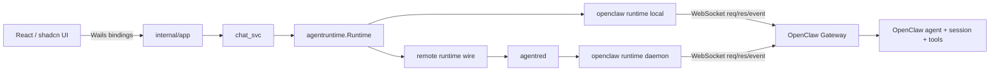

# OpenClaw Agent Backend 接入设计

> 状态：方案与 Mockup 待评审；**未进入正式实现**  
> 分支：`feat/openclaw-integration-mockup`  
> 基线：`main@5a7d1a1`

## 1. 目标与边界

在 Agentre 中新增 `openclaw` Agent Backend，让现有 Agent、组织、会话和聊天 UI 可以通过 OpenClaw Gateway 驱动 OpenClaw agent，同时保持 Agentre 现有数据模型、Wails IPC、远端 `agentred` 和 `agentruntime` 事件体系不变。

本轮只交付：

1. 接入架构与协议映射方案；
2. 能力矩阵、风险和 TDD 实施顺序；
3. 可交互静态 Mockup。

本轮明确不做：

- 不新增 `TypeOpenClaw` 正式代码；
- 不修改数据库 schema；
- 不连接真实 Gateway；
- 不保存任何真实 token；
- 不让 Codex 开始实现。

## 2. 已确认结论

**OpenClaw 使用 Gateway WebSocket RPC 实现完整的 Gateway-native runtime，不以“接通聊天”为目标做简化兼容层。**

该技术路线已于 2026-07-24 确认：

- 唯一正式运行主链路：OpenClaw Gateway WebSocket RPC；
- `openclaw acp`、OpenResponses / Chat Completions HTTP API 不作为正式 backend 运行链路；
- `openclaw agent` CLI 仅保留为开发期协议对照、诊断和应急排障工具，不进入正常 turn 生命周期；
- MVP 的设计必须覆盖完整连接生命周期、协议协商、session、流式事件、工具事件、usage、abort、重连对账、幂等和安全存储，不能因为 HTTP/CLI 更容易接入而降低架构目标；
- exec approvals 纳入 MVP；plugin approvals、ask-user、subagent 和高级 session 管理可按迭代交付，但底层连接和事件模型必须从第一版开始为这些能力保留完整扩展点；
- Agentre 前端仍只调用 `internal/app` Wails bindings，不新增 HTTP API；
- 本地 backend 由桌面进程直连 Gateway；远端 backend 由 `agentred` 所在设备直连 Gateway；
- 每条 Agentre `chat_session` 稳定映射到一个 OpenClaw `sessionKey`，并把该 key 存入现有 `ProviderSessionID`；
- OpenClaw token 作为专用 secret 字段处理，不写日志、不进 Mockup、不塞进通用 `env_json`。

## 3. 为什么选择 Gateway WebSocket RPC

| 维度 | Gateway WebSocket RPC | `openclaw agent` CLI |
| --- | --- | --- |
| 流式输出 | 原生 `event` 帧 | 需解析 stdout，能力受 CLI 输出格式限制 |
| session 复用 | 原生 `sessionKey` / `sessions.*` | 可传 session，但生命周期与事件观测更弱 |
| abort | `chat.abort` | 依赖进程信号，语义更粗 |
| approvals / ask-user | 可订阅 Gateway 事件并 RPC 回写 | 很难完整映射交互控制 |
| agent / model 枚举 | `agents.list` / `models.list` | 需额外命令与解析 |
| 远端 `agentred` | daemon 内建立 WS 即可 | 需远端安装 CLI 并管理进程 |
| 协议稳定性 | 官方 Gateway 协议，版本协商 | CLI 文本输出更易变化 |
| 实现复杂度 | 需要连接管理和事件路由 | happy path 简单，但完整能力成本更高 |

OpenClaw 官方外部应用文档当前没有公开 npm client package，因此 Go 端应实现最小 Gateway client，只依赖公开 WebSocket JSON 协议，不引入非官方 JS 客户端。

## 4. 总体架构



保持仓库现有六层接入方式：

1. **entity**：增加 backend type 与 OpenClaw 专属配置；
2. **repository**：迁移和 CRUD；
3. **service/app**：列表、保存、探测、枚举 agents/models；
4. **agentruntime**：Gateway client、session cache、事件翻译、控制接口；
5. **daemon/wire**：让远端运行能力和本地保持一致；
6. **frontend**：backend 编辑器、连接探测和聊天状态展示。

## 5. Backend 数据模型

### 5.1 推荐字段

`AgentBackend` 增加专用字段，不复用语义错误的 `CLIPath` / `GatewayURL`（后者当前指 Agentre LLM Provider gateway）：

| 字段 | 类型 | 说明 |
| --- | --- | --- |
| `OpenClawGatewayURL` | string | `ws://127.0.0.1:18789` 或 `wss://...` |
| `OpenClawTokenCiphertext` | secret/blob | Gateway token，加密落库；任何 API 返回均只给 `hasToken` |
| `OpenClawAgentID` | string | 默认 OpenClaw agent id；为空时使用 Gateway 默认 agent |
| `OpenClawDefaultModel` | string | 可选覆盖；为空走 OpenClaw agent/session 默认 |
| `OpenClawSessionMode` | enum | MVP 固定 `per-agentre-session`，预留 `shared` / `ephemeral` |
| `OpenClawTLSInsecure` | bool | 默认 false；仅开发环境显示高级开关 |

如果仓库现有 secret storage 能力不足，MVP 可先使用 OS keyring/项目统一 secret store；**不建议把 token 放进 `EnvJSON` 或明文字段**。

### 5.2 Entity 约束

新增 `TypeOpenClaw = "openclaw"` 和 `openClawKind`：

- 不绑定 Agentre `LLMProvider`；模型与认证由 OpenClaw 管理；
- 不允许 `CLIPath`、`ModelRoutes`、`Sandbox`、`Approval`、`DefaultPermissionMode`；
- 必须有合法 `ws://` / `wss://` URL；
- token 可为空以支持 Gateway 本地无认证配置，但 UI 必须显示安全提醒；
- `DeviceID` 语义沿用：空=桌面设备直连，非空=`agentred` 设备直连。

## 6. Gateway 连接与认证

### 6.1 连接状态机

```text
idle -> connecting -> challenged -> ready
                     \-> auth_failed
connecting/ready -> disconnected -> reconnecting -> ready
                                  \-> failed
```

1. 建立 WebSocket；
2. 接收 `connect.challenge`；
3. 发送首个请求 `connect`，声明兼容协议范围、客户端身份、`operator` role 和最小 scopes；
4. 校验 `hello-ok`/连接响应；
5. 开启 reader loop：按 frame `id` 路由响应，按 `event` 分发事件；
6. 心跳/断线后指数退避重连；正在运行的 turn 不盲目重放，先查 run/session 状态。

### 6.2 最小 scopes

MVP 目标：

- `operator.read`：探测、agents/models/session/history；
- `operator.write`：发送、终止、创建 session；
- `operator.approvals`：读取、接收和回写 exec/plugin approval。

探测结果必须展示实际 granted scopes；scope 不足时保存配置可以允许，但运行前给出明确错误。

### 6.3 幂等与超时

- `agent`、`chat.send`、`sessions.send` 等副作用 RPC 每次都带 UUID idempotency key；
- transport 超时和 agent run 超时分开；
- transport 断开后，只有在确认请求未被接受时才重试；状态不确定时按 run id / session history 对账，避免重复消息。

## 7. Session 生命周期与映射

### 7.1 推荐模式：每个 Agentre chat session 对应一个 OpenClaw session

首次发送：

1. 生成稳定 session key：`agentre:<backendID>:<chatSessionID>`；
2. 可选调用 `sessions.create` 创建/收养该 key，并传 `agentId`、label、model；
3. 把 OpenClaw 返回 key 存入 `RunResult.ProviderSessionID`；
4. 后续 turn 使用相同 key 调 `chat.send` 或 `agent`。

恢复已有会话：

- `ProviderSessionID` 非空时先使用该 key；
- 重连后用 `sessions.resolve` / `sessions.describe` 核对所有权；
- 不从本地 `sessions.json` 直接读取，所有跨进程访问走 Gateway RPC。

### 7.2 新建、复用和清理

- Agentre 新建聊天：创建新 OpenClaw session key；
- Agentre 普通继续聊天：复用；
- Agentre 删除本地聊天：MVP **只删除本地映射，不自动删 OpenClaw session**，避免破坏外部数据；后续可提供显式“同时删除远端会话”；
- 重新生成：MVP 先标为不支持 provider rewind，保留本地消息后走新 session/fork；后续评估 OpenClaw `sessions.create { parentSessionKey, fork:true }`；
- compact：若 Gateway 暴露稳定 session compact RPC则映射，否则显示 capability unavailable。

## 8. Run 与事件映射

### 8.1 建议 RPC

MVP 发送优先使用 `agent`：它直接接受 `message`、`agentId`、`model`、`sessionKey`、`thinking`、`attachments`、`cwd` 和 idempotency key，并返回 run id；随后通过 Gateway agent/chat event 与 `agent.wait` 完成收尾。

`chat.send` 可作为后续对齐 Control UI 的替代入口。实现前应写协议 fixture 测试，验证当前 Gateway 版本两条路径的事件完整性，再固定一种。

### 8.2 OpenClaw → agentruntime

| OpenClaw 信号 | Agentre `agentruntime.Event` | MVP |
| --- | --- | --- |
| chat/agent text delta | `TextDelta` | 支持 |
| thinking delta | `ThinkingDelta` | 能可靠区分时支持 |
| tool start | `ToolUseStart` | 支持 |
| tool result/end | `ToolResult` / `ToolUseEnd` | 支持 |
| usage | `UsageUpdate` | 支持，未知字段忽略 |
| final | `Done` + `RunResult` | 支持 |
| aborted | terminal abort | 支持 |
| error | `ErrorEvent` | 支持 |
| retry/rate limit | `Retry` | 支持 |
| `exec.approval.requested` | `ToolPermissionRequest` | MVP 支持 |
| `exec.approval.resolved` | permission terminal update | MVP 支持，并与命令执行完成分开 |
| plugin approval request/resolved | `ToolPermissionRequest` | P1，复用统一审批模型 |
| ask-user tool/card | `AskUserQuestion` | P1；需明确可回写协议 |
| subagent activity | `SubagentStarted/Progress/Done` | P1 |
| plan/status | `PlanUpdated` / `RuntimeStatus` | 可映射则支持 |

事件必须按 `runId + sessionKey + seq` 去重和排序；连接级事件不能误投到其它 Agentre session。

### 8.3 控制接口

| Agentre runtime interface | OpenClaw RPC | 阶段 |
| --- | --- | --- |
| `Aborter.Abort` | `chat.abort {sessionKey, runId}` | MVP |
| `Steerer.Steer` | 当前 Gateway 无等价稳定 chat steer 时，排队到下一 turn | MVP 降级 |
| `ToolPermissionSink` | `exec.approval.resolve` | MVP |
| `AskAnswerSink` | 对应 ask-user/tool result 回写 | P1 |
| `GoalController` | OpenClaw goal tool/会话能力 | P2，不在首版承诺 |
| compact/rewind | session compact/fork | P2 |

### 8.4 Exec Approval 协议与状态机

OpenClaw exec approval 是 Gateway/Node 宿主命令执行前的本地安全闸门，不是普通 chat tool event，也不是多租户用户鉴权边界。AgentRE 作为审批客户端必须在 `connect` 时申请 `operator.approvals`，并独立维护 pending approval 队列。

正常流程：

1. OpenClaw 根据 tool policy、elevated gating、`tools.exec.*`、执行宿主本地 approvals file、allowlist/safeBins 等规则计算有效策略；宿主 approvals 只能收紧，不能放宽配置策略；
2. 需要人工审批时，Gateway 创建带过期时间的 pending record，广播 `exec.approval.requested`；
3. AgentRE 展示命令、cwd、host/node、agent、session、风险分析、过期时间和服务端提供的 `allowedDecisions`；
4. 用户选择后调用 `exec.approval.resolve { id, decision }`；decision 只能是该请求实际允许的 `allow-once`、`allow-always`、`deny`；
5. Gateway 广播 `exec.approval.resolved`。该事件只表示审批完成，不表示命令执行完成；
6. `allow-once` 仅放行当前执行；`allow-always` 在策略和命令形态允许时把规则写入实际执行宿主、对应 agent 的 allowlist；`deny` 不执行命令；
7. Node 执行必须复用审批时保存的 canonical `systemRunPlan`。command/rawCommand、cwd、agentId、sessionKey 或绑定环境发生变化时拒绝执行；
8. 最终执行结果继续通过 exec lifecycle/session followup 进入原会话，映射为 tool result / done / error，不能用 approval resolved 冒充执行结果。

重连与竞态：

- 首次 ready 和每次重连后调用 `exec.approval.list`，以 Gateway pending 列表为准恢复队列；
- requested/resolved/list 都按 approval id 去重；
- 多客户端并发审批时第一个成功决策生效，`APPROVAL_ALREADY_RESOLVED`、`APPROVAL_NOT_FOUND`、未知或过期 id 都应转为幂等终态并刷新列表；
- 断线期间不自动批准、拒绝或重新创建审批；默认 pending timeout 为 30 分钟，默认无 UI/超时 fallback 为 deny；
- `allowedDecisions` 必须动态渲染。例如有效策略要求每次都审批时，不显示 `allow-always`；
- Gateway host 和 Node host 都在实际执行宿主强制审批；AgentRE 不能通过请求参数绕过更严格的宿主本地策略。

建议内部状态：

```text
pending -> resolving -> allowed_once | allowed_always | denied
        -> expired | already_resolved | unavailable
```

审批实体至少保存 `approvalID + sessionKey + agentID + runID/toolCallID（若可关联）+ host/nodeID + expiresAt`。审批命令和风险详情只按现有聊天安全策略展示/持久化，不额外写入 debug 日志。

## 9. Backend 探测与配置 UX

“测试连接”不是只测 TCP，而是返回结构化结果：

1. Gateway URL 可达；
2. 协议协商成功；
3. token/auth 是否通过；
4. Gateway 版本与 protocol version；
5. granted scopes；
6. agents 列表；
7. models 列表；
8. 选中 agent/model 是否存在；
9. 若绑定远端设备，探测必须在该 `agentred` 设备执行。

UI 保存流程：

- 输入地址和 token；
- 点击“测试并加载”；
- 成功后显示 Gateway 版本、延迟、scope，并解锁 agent/model 下拉；
- token 编辑框始终不回显真实值，只显示“已保存”占位；
- agent/model 列表探测失败时允许手填，但给出 warning。

## 10. 远端 `agentred`

OpenClaw backend 应像现有 CLI backend 一样支持 `DeviceID`：

- desktop 只把 backend id / 非敏感配置和运行请求交给 daemon wire；
- token 的远端策略必须明确：
  - 推荐：token 同步到远端设备自己的 secret store，只传 secret reference；
  - 不推荐：每 turn 从 desktop 明文发送 token；
- daemon 注册 `openclaw` runtime import；
- `TestAgentBackend` 在绑定设备时通过 daemon 执行；
- capability 与本地 runtime 用同一份声明，wire 只序列化 canonical events。

首版如 secret 同步设施尚未满足，可把“远端 OpenClaw”标为 P1，MVP 先本地直连；但 entity 和 wire 设计不能堵死远端模式。

## 11. 安全与隐私

- token 永不进入日志、错误详情、Wails model、前端 state dump、测试 fixture、git tracked 文件；
- URL 日志需去掉 query/userinfo；
- 默认只允许 `ws://127.0.0.1`，非 loopback 明文 WS 显示高风险警告；远端地址建议强制 `wss://`；
- TLS 跳过校验默认关闭，并只放在高级设置；
- Gateway 返回的 tool input/result 按现有聊天数据策略落库，不能额外复制到 debug log；
- 测试使用假的 token 和本地 fake Gateway。

## 12. Capability Matrix

| 能力 | MVP | 后续 |
| --- | --- | --- |
| 本地 Gateway 连接/auth/protocol | ✅ | — |
| agent/model 探测与选择 | ✅ | 动态刷新 |
| session 新建/复用/历史核对 | ✅ | fork/delete/compact |
| 文本流式输出 | ✅ | — |
| tool call/result 展示 | ✅ | richer metadata |
| usage/model/context window | ✅ 尽力 | 精确 catalog |
| abort | ✅ | — |
| attachments | 文本/文件能力实测后择一 | 完整多模态 |
| exec approvals | ✅ list/requested/resolved、allow once/always/deny、重连对账 | richer risk UI |
| plugin approvals | ❌ | P1，复用统一审批模型 |
| ask-user | ❌ | P1 |
| steer | 降级为下一 turn | 若 Gateway 提供稳定 RPC则原生支持 |
| remote `agentred` | 设计兼容，是否进 MVP取决于 secret store | ✅ |
| autonomous/background/subagent | ❌ | P1/P2 |
| CLI fallback | ❌ | 诊断/降级 |

## 13. TDD / BDD 实施顺序

严格 Red → Green → Refactor。每个 slice 先写 happy path + 至少一个错误/边界场景。

### Slice 1：entity + migration

- Red：`TypeOpenClaw` 最小合法配置通过；非法 URL、互斥字段、未知 session mode 失败；
- Green：kind、字段、migration；
- Refactor：共享 URL/secret 校验。

### Slice 2：fake Gateway protocol client

- Red：challenge/connect 成功、auth 失败、响应乱序、断线、超时、未知 event；
- Green：最小 WS client + request registry；
- Refactor：连接状态机和脱敏错误。

### Slice 3：backend probe

- Red：返回版本/scopes/agents/models；scope 不足和 agent 不存在；
- Green：service + Wails binding + daemon probe wire；
- Refactor：结构化 probe result。

### Slice 4：runtime happy path

- Red：新 session、复用 session、text delta、tool、usage、final；
- Green：OpenClaw runtime translator；
- Refactor：sealed canonical event fixtures。

### Slice 5：abort / reconnect / idempotency

- Red：abort 正确定位 run；断线不重复消息；旧 run event 不串台；
- Green：run registry、dedupe、reconcile；
- Refactor：session cache。

### Slice 6：exec approval

- Red：requested 建卡、动态 decisions、resolve 成功、双客户端重复决策、过期、重连 list 对账、resolved 不冒充 exec finished；
- Green：approval registry、Gateway event router、`ToolPermissionSink`；
- Refactor：抽出 exec/plugin 可复用的 approval envelope，保留各自 payload adapter。

### Slice 7：UI

- Red：创建 OpenClaw backend；测试后加载选项；token 不回显；错误状态可恢复；审批卡按 `allowedDecisions` 渲染；
- Green：编辑器、状态 badge 和 exec approval 卡片；
- Refactor：拆分 `OpenClawBackendFields` 和 `OpenClawApprovalCard`，避免继续放大现有组件。

### Slice 8：plugin approval / ask-user（P1）

plugin approval 复用审批队列与动态 decision UI；ask-user 必须先捕获真实请求/回写帧再写回归测试，无法稳定复现则不宣称支持。

## 14. 主要风险与对策

1. **Gateway 协议版本变化**：connect 阶段协商；所有 schema fixture 带版本；未知字段宽容、未知事件记录类型不记录内容。
2. **审批事件并非普通 chat event**：独立订阅 `exec.approval.requested/resolved`，重连调用 `exec.approval.list`，并把审批终态与命令执行终态分开。
3. **OpenClaw 与 Agentre 都持久化历史**：OpenClaw 是 provider-side 会话，Agentre DB 仍是 UI 事实来源；不把远端 history 无条件覆盖本地历史。
4. **断线重试造成重复消息**：副作用 RPC 强制 idempotency key，重连后先 reconcile。
5. **远端 token 泄漏**：使用 secret reference/store；条件不满足就延后远端能力。
6. **现有 backend 编辑器过大**：新增类型时拆出专属字段组件与纯函数，避免继续堆条件分支。
7. **工具事件结构不完全统一**：Gateway adapter 负责 normalizing，chat_svc 不感知 OpenClaw 私有 schema。

## 15. 产品决策状态

### 已确认

1. Gateway WebSocket RPC 是唯一正式运行主链路；不采用 ACP、HTTP 或 CLI 作为简化主链路。
2. 方案必须面向完整 OpenClaw 能力设计，不能只满足基础文本聊天。
3. CLI 仅用于开发期协议对照、诊断和应急排障。

### 仍需在实现前确认

1. OpenClaw backend 默认是否采用“一条 Agentre chat session = 一条 OpenClaw session”？（推荐是）
2. MVP 是否先只支持本机 Gateway，远端 `agentred` 放 P1？（若现有 secret store 可复用，可一起做）
3. 删除 Agentre 会话时，是否默认保留 OpenClaw 远端 session？（推荐保留）
4. exec approvals 已确认纳入 MVP；plugin approvals 与 ask-user 是否接受放到 P1？（推荐是）

## 16. Mockup

旧的独立 HTML 概念稿已删除，不再作为 UI 评审依据。

当前 Mockup 使用 AgentRE 真实的 Tailwind design tokens、shadcn/ui 组件、`AgentreDialog`、表格、按钮、表单和应用布局密度，通过独立 Vite 入口运行，不修改生产入口：

```bash
cd frontend
pnpm dev --host 127.0.0.1
```

访问：

- 后端列表：`/openclaw-mockup.html?view=list`
- Gateway 配置：`/openclaw-mockup.html?view=dialog`
- 聊天与审批：`/openclaw-mockup.html?view=chat`

源文件：

- `frontend/openclaw-mockup.html`
- `frontend/src/mockups/openclaw-main.tsx`
- `frontend/src/mockups/openclaw-integration.tsx`

截图：

- [`docs/mockups/openclaw-integration-list.png`](../../mockups/openclaw-integration-list.png)
- [`docs/mockups/openclaw-integration-dialog.png`](../../mockups/openclaw-integration-dialog.png)
- [`docs/mockups/openclaw-integration-chat.png`](../../mockups/openclaw-integration-chat.png)

覆盖：

- Backend 列表中的 OpenClaw Gateway-native 类型；
- WebSocket 地址、secret token、协议握手、agent/model 和 session 策略；
- 连接超时、重连对账和删除 session 策略；
- 聊天页连接状态、session key、工具流，以及符合真实 Gateway 协议的 exec approval：动态决策、宿主/agent/session/过期信息和 allowlist 影响提示。

该入口仅是 UI Mockup，不包含正式 Go runtime、数据库字段、Wails binding 或真实 Gateway 连接。
